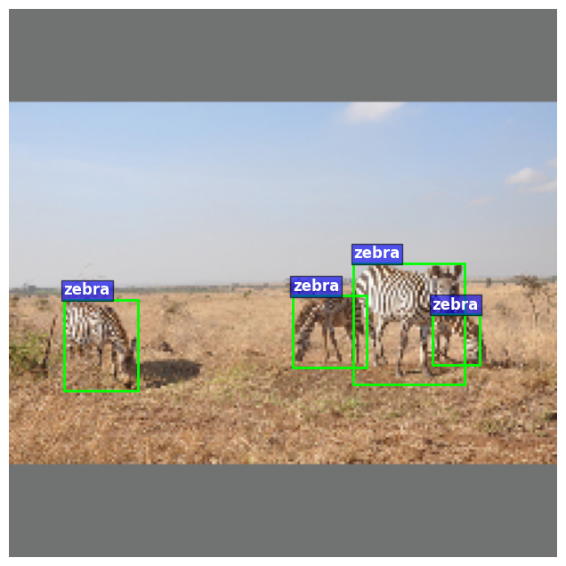
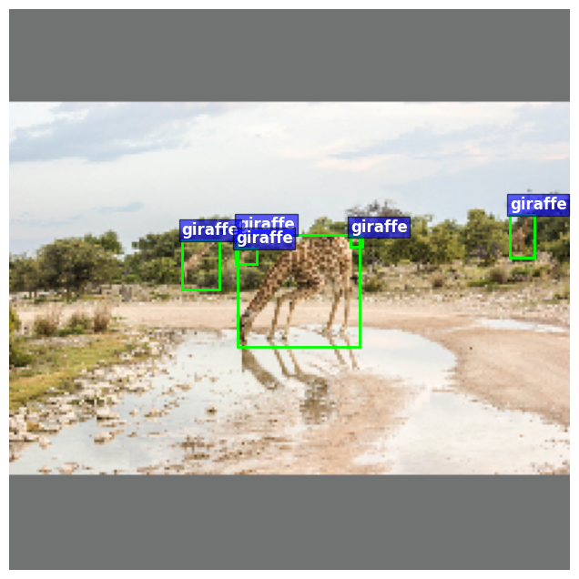
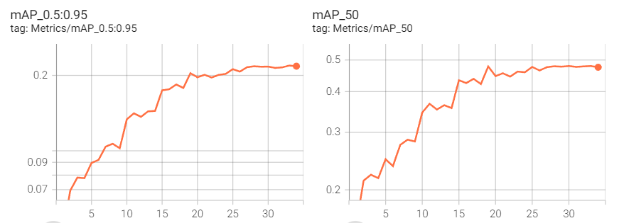
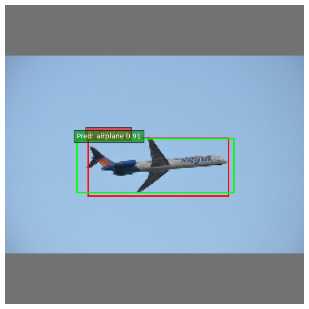
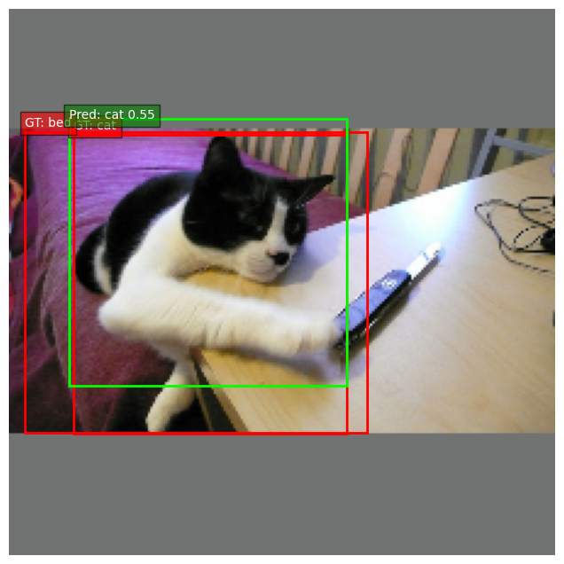

# Object Detection on COCO2017

**Course**: Deep Learning\
**Group**: 8  
**Team Members**:

- Lê Văn An
- Phạm Gia Bảo
- Dương Hưng
- Huỳnh Hậu
- Huỳnh Thị Cẩm Giang

## 1. Project Overview

This project implements an object detection pipeline to detect and classify
multiple objects in an image using the COCO2017 dataset.

The main objective is to understand and implement the full workflow of
object detection, including data preprocessing, model training, inference,
and evaluation.

---

## 2. Problem Definition

- **Input**: RGB images with varying resolutions.
- **Output**: Bounding boxes and class labels for detected objects.
- **Task**: Multi-class object detection.

---

## 3. Dataset

- Dataset: COCO 2017
- Number of classes: 10
- Categories name: Airplane, Bus, Train, Cat, Dog, Elephant, Zebra, Giraffe, Couch, Bed
- Training images: ~30,000
- Validation images: ~1,000

Annotations are provided in JSON format with bounding boxes defined as:
[x, y, width, height].




---

## 4. Data Preprocessing

The following preprocessing steps are applied to the dataset:

- Remove invalid bounding boxes and crowd annotations (`iscrowd = 1`)
- Map COCO category IDs to continuous class indices
- Resize images using `letterbox` to preserve aspect ratio
- Convert bounding boxes to the model-specific format
- Normalize images using ImageNet mean and standard deviation

---

## 5. Model Architecture

- Backbone: Resnet50 pre-trained
- Neck: FPN
- Detection Head: YOLO-style detection head
- Loss components:
  - Bounding box regression loss
  - Classification loss
  - Objectness loss

---

## 6. Training Configuration

- Optimizer: AdamW
- Learning rate: 2e-4
- Batch size: 32
- Image size: 224 × 224
- Number of epochs: 35

---

## 7. Evaluation

The model is evaluated on the validation set using COCO-style metrics:

- `mAP` = 0.218
- `AP50` = 0.48

## 

## 8. Inference and Visualization

During inference, predicted bounding boxes and class labels are visualized
on input images. Non-Max Suppression (NMS) is applied to remove duplicate
detections.




---

## 9. Project Structure

```
OBJECT_DETECTION_COCO2017/
├── assets/        # Hình ảnh minh họa, kết quả dự đoán
├── checkpoints/   # Model checkpoints
├── data/          # Dữ liệu COCO (images, annotations)
├── datasets/      # Dataset loader và collate_fn
├── docs/          # Tài liệu, báo cáo
├── models/        # Định nghĩa mô hình
├── notebooks/     # Thống kê dataset, split dataset
├── runs/          # Logs huấn luyện
├── src/           # Code train / eval
├── utils/         # Hàm tiện ích (NMS, decode, visualize)
├── configs.yaml   # Cấu hình huấn luyện
├── delivery.ipynb # Notebook tổng hợp kết quả
├── README.md
└── requirements.txt

```
